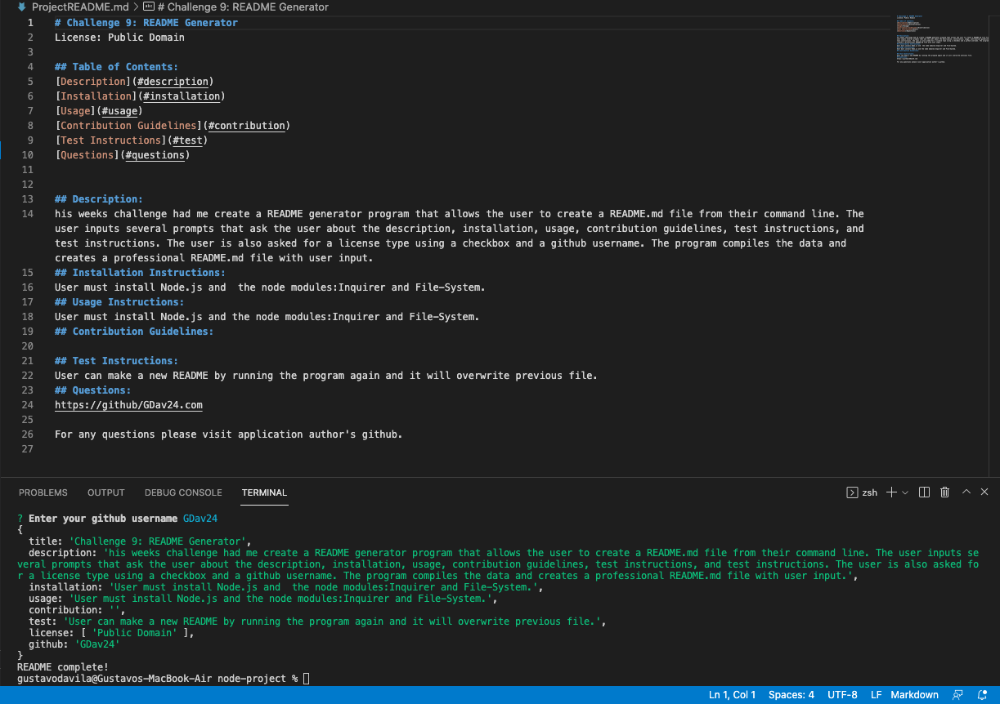

# Challenge 9: README Generator       
License: Public Domain

## Table of Contents:
[Description](#description)
[Installation](#installation)
[Usage](#usage)
[Contribution Guidelines](#contribution)
[Test Instructions](#test)
[Questions](#questions)

## Description: 
his weeks challenge had me create a README generator program that allows the user to create a README.md file from their command line. The user inputs several prompts that ask the user about the description, installation, usage, contribution guidelines, test instructions, and test instructions. The user is also asked for a license type using a checkbox and a github username. The program compiles the data and creates a professional README.md file with user input. This README was created using the README generator program.
## Installation Instructions: 
User must install Node.js and the node modules:Inquirer and File-System. 
## Usage Instructions: 
User must install Node.js and the node modules:Inquirer and File-System. 
## Contribution Guidelines: 
 
## Test Instructions: 
User can make a new README by running the program again and it will overwrite previous file.
## Questions:
https://github/GDav24.com

For any questions please visit application author's github.
## Links to Program
Github Repo: 
https://github.com/GDav24/readmegenerator
Google Drive with demo video:
https://drive.google.com/file/d/1nm5TxgZKvF8j5lSrPTdXpVGokZq7XFvr/view

